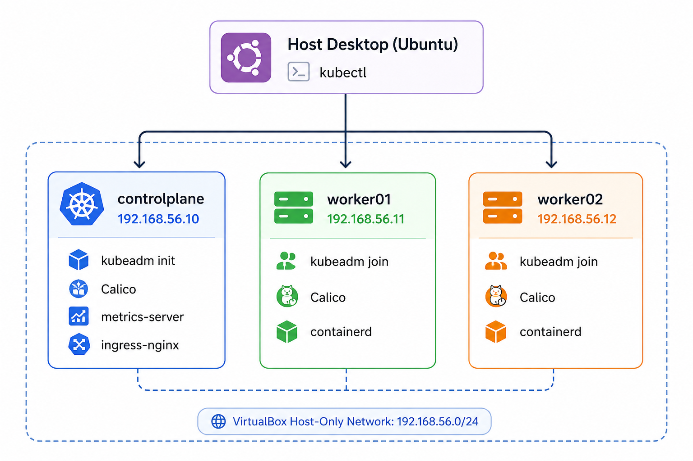

# Autonomous CKA Kubernetes Lab

Certified Kubernetes Administrator (CKA) exam practice environment. Powered by Vagrant (VirtualBox) and Ansible, featuring 1 Control Plane + 2 Worker nodes running on Ubuntu LTS.

> [!IMPORTANT]
> This lab was created for my personal practice with CKA/CKAD exam scenarios. Feel free to fork it, customize it, and create your own version to match your learning goals.
>
> If you are looking for a Kind Kubernetes cluster setup, check out:
> https://github.com/nmdra/kind-cluster-terraform

## Architecture & Network



> [!TIP]
> The entire cluster bootstraps, initializes networking, joins worker nodes, and exports the cluster `admin.conf` back to your desktop autonomously upon running `vagrant up` or `make up`.

## Stack Specification

| Component | Version | Description & Exam Alignment |
| :--- | :--- | :--- |
| **Kubernetes** | `v1.36.2` | Dynamically resolved from `pkgs.k8s.io` DEB repo (pinned in `all.yml`) |
| **OS Runtime** | `Ubuntu 24.04 LTS` | Noble Numbat — aligns with modern CNCF Linux benchmark |
| **CRI Engine** | `containerd 2.3.x` | Upstream package (`containerd.io`), configured with `SystemdCgroup = true` |
| **CNI Plugin** | `Calico v3.32.0` | Provides Pod CIDR (`192.168.0.0/16`) + full `NetworkPolicy` enforcement |
| **Metrics** | `metrics-server` | Patched for lab TLS; enables instant `kubectl top nodes/pods` |
| **Ingress** | `ingress-nginx v1.15.1` | Kept specifically for traditional Ingress controller practice |

## Quickstart & Day-to-Day Workflow

### 1. Boot Cluster from Scratch
```bash
make up
```
*(Takes ~4 to 5 minutes. Bootstraps VMs, installs runtimes, configures sysctl/swap, runs `kubeadm init`, joins workers, and drops kubeconfig into `./configs/config`).*

### 2. Access Cluster from Host Desktop
```bash
export KUBECONFIG=configs/config

make status
kubectl get nodes -o wide
kubectl top nodes
```

### 3. SSH & Exam Habits Script
Every VM is injected with `exam-setup.sh` on boot, enabling killer.sh / official CKA terminal aliases automatically:
```bash
make ssh-cp

# Inside VM:
k get pods -A          # 'k' auto-aliased to kubectl with bash completion
kgp                    # alias for 'kubectl get pods'
k run nginx --image=nginx $do   # '$do' auto-expands to '--dry-run=client -o yaml'
```

## Lifecycle Management

- **Fast Config Iteration:** If you edit Ansible playbooks or variables in `playbooks/group_vars/all.yml`:
  ```bash
  make provision
  ```
  *(100% idempotent. Skips already initialized components and safely applies updates).*

- **Graceful Shutdown (Save Host RAM):**
  ```bash
  make halt
  ```

- **Nuclear Reset (Wipe & Recreate):**
  ```bash
  make rebuild
  ```

## Pinning to Exact CKA Exam Version (v1.35.x)

1. Open `Vagrantfile` and edit the Ansible extra vars block:
   ```ruby
   ansible.extra_vars = {
     k8s_version: "1.35.5",
     k8s_minor:   "1.35",
   }
   ```
2. Rebuild the lab:
   ```bash
   make rebuild
   ```
## Autonomous AI Proctor & Coach (CKA Neko)

This repository bundles an AI coding assistant (experimental) skill (**CKA Neko**) designed to train you under realistic exam conditions.

In your AI terminal chat (Claude Code / Gemini CLI), invoke Neko:
```text
/cka-neko
```

### Core Skill Capabilities
- **Socratic "Grill Me" Speed Drills:** Isolates 1 complex CKA performance task at a time (RBAC, ETCD restore, Ingress routing, Upgrades, NetworkPolicy) under a 3-minute stopwatch. Refuses to give direct answers; provides progressive Socratic hints instead.
- **Nuclear Lab Maintenance (`make rebuild`):** Safely wipes and rebuilds all cluster VMs autonomously with built-in confirmation prompts.
- **Self-Healing Diagnostics:** Troubleshoots NotReady nodes, CNI network glitches, and CRI engine errors dynamically against your `Vagrantfile`.
- **Official Docs Only:** Exclusively fetches reference manifests and quotes directly from official `https://kubernetes.io/docs/` pages (building 100% exam-legal habits).

## Repository Structure

```text
CKA-Env/
├── Vagrantfile             # VirtualBox VM specs & IP mapping (192.168.56.X)
├── Makefile                # Self-documenting shortcuts (make up, halt, rebuild, status)
├── ansible.cfg             # Ansible formatting & callback settings
├── exam-setup.sh           # CKA bash aliases and dry-run habits
├── configs/                # Shared VirtualBox bridge directory
│   ├── config              # Auto-exported cluster admin kubeconfig
│   └── join.sh             # Auto-generated kubeadm join token relay
├── inventory/
│   └── hosts.ini           # Static cluster inventory reference
└── playbooks/
    ├── site.yml            # Master orchestration playbook
    ├── group_vars/all.yml  # Centralized version pinning & CIDR tokens
    └── roles/
        ├── common/         # Kernel modules, containerd CRI setup, APT repos
        ├── control-plane/  # kubeadm init, Calico CNI, metrics, Ingress
        └── worker/         # Token watchdog & kubeadm join execution
```
